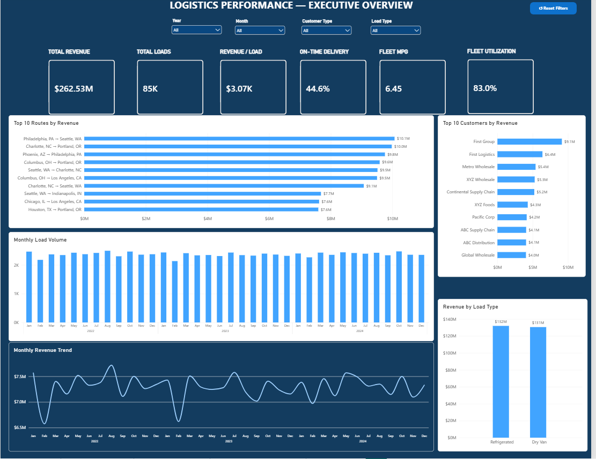
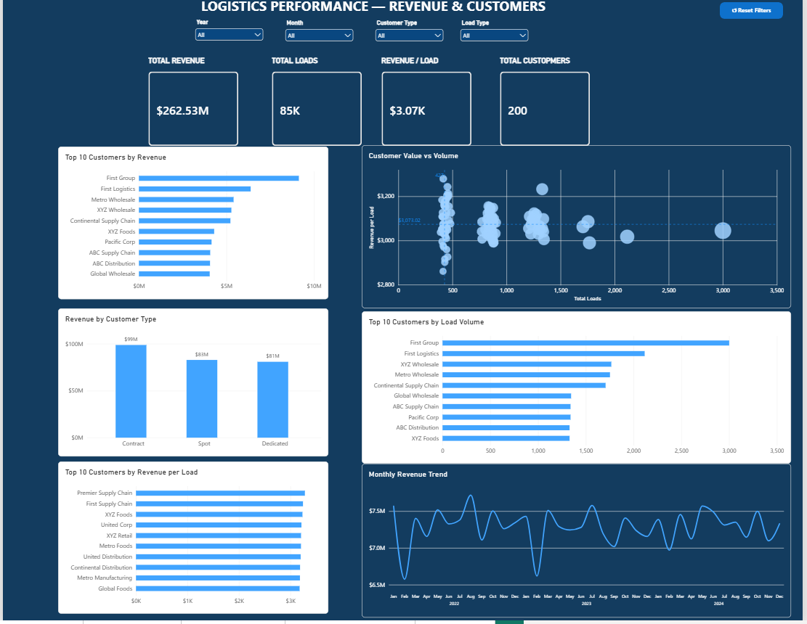
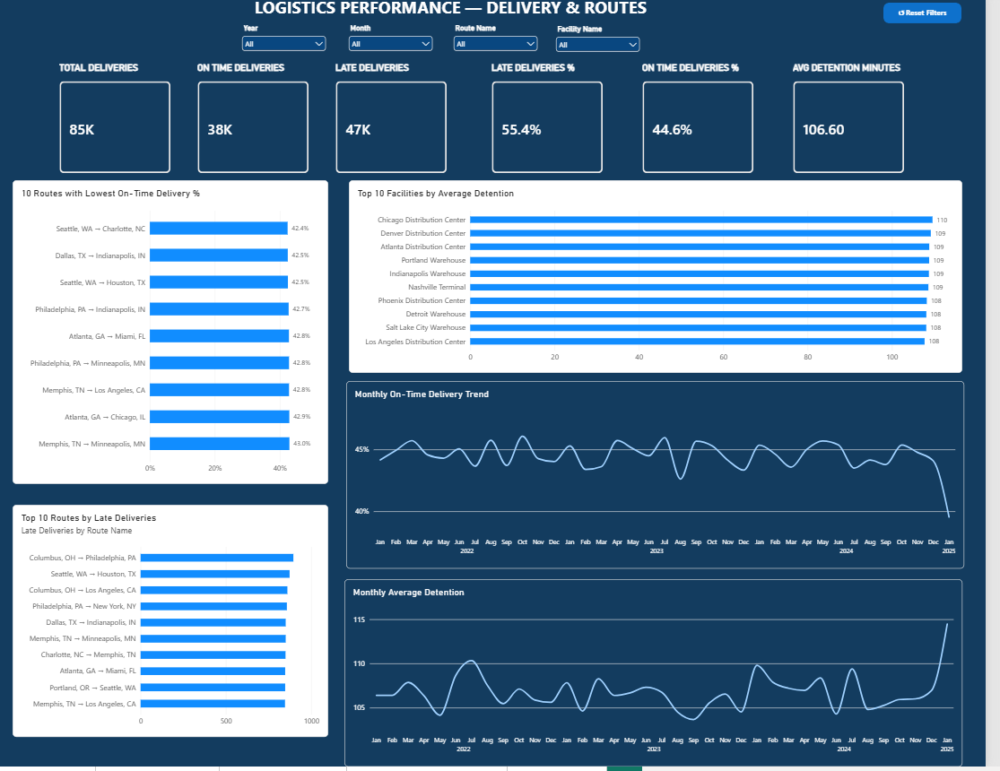
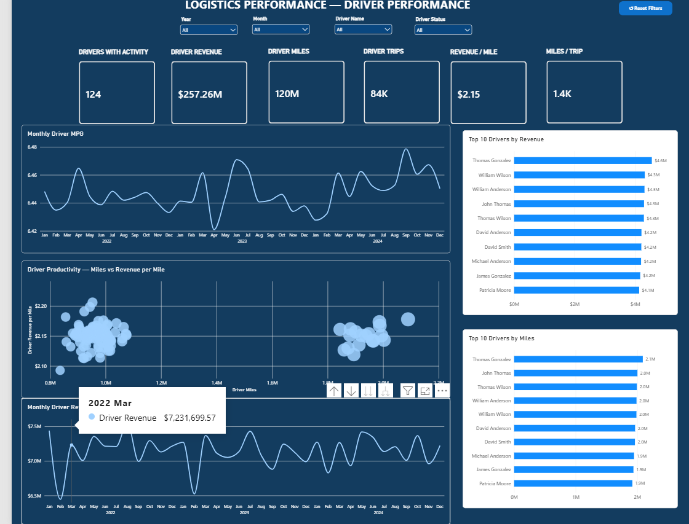
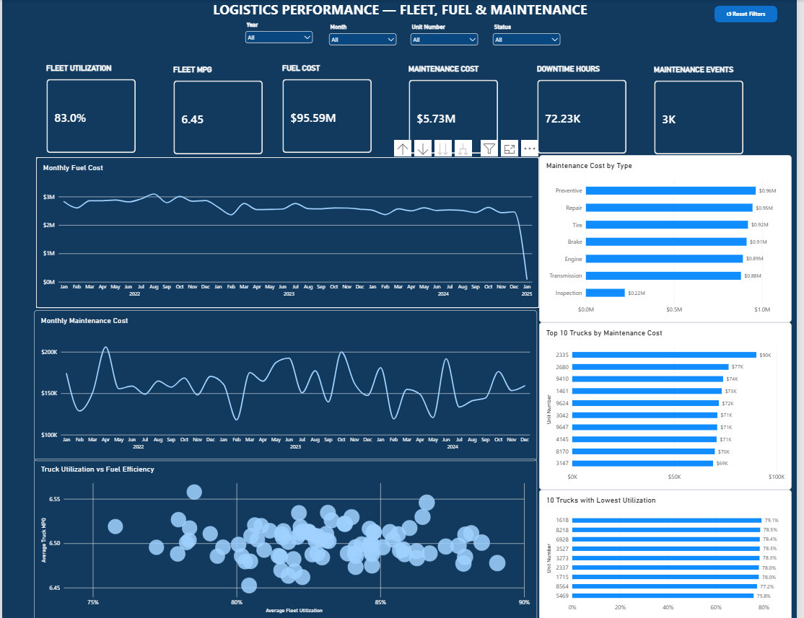
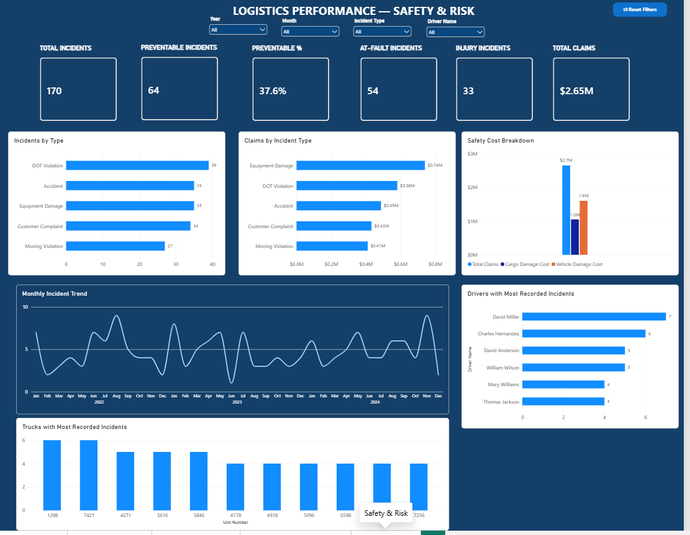

# Logistics & Fleet Performance Analytics | Power BI

> End-to-end Power BI analytics solution covering **85,410 logistics loads**, approximately **$262.53M in revenue**, delivery performance, customers, drivers, fleet operations, fuel, maintenance, and safety.

## Project Overview

I developed this six-page Power BI analytics solution for a logistics project, handling the data preparation, modeling, DAX development, dashboard design, validation, and business analysis.

The solution integrates **14 operational datasets** and analyzes **85,410 loads representing approximately $262.53M in revenue**.

The report contains six analytical views:

**Executive Overview • Revenue & Customers • Delivery & Routes • Driver Performance • Fleet, Fuel & Maintenance • Safety & Risk**

> **Portfolio disclosure:** This solution was developed for another party and is included here to demonstrate my Power BI and analytics work. The portfolio presentation does not imply ownership of the underlying business or data.

## Case Study

For the complete project methodology, dashboard analysis, findings, limitations, and recommendations:

[View the Full PDF Case Study](Logistics_Fleet_Performance_Case_Study.pdf)

## Key Performance Indicators

| KPI | Result |
|---|---:|
| Total Revenue | $262.53M |
| Total Loads | 85,410 |
| Revenue per Load | $3.07K |
| On-Time Delivery | 44.6% |
| Late Delivery | 55.4% |
| Average Detention | 106.6 min |
| Fleet Utilization | 83.0% |
| Fleet MPG | 6.45 |
| Fuel Cost | $95.59M |
| Maintenance Cost | $5.73M |
| Safety Incidents | 170 |
| Preventable Incidents | 37.6% |
| Recorded Claims | $2.65M |

## Business Questions
- How much revenue and load volume are being generated?
- Which customers and customer segments contribute the most revenue?
- Which routes and facilities require delivery-performance investigation?
- How do drivers compare on revenue, miles, trips, and efficiency?
- How efficiently is the fleet utilized and what are the major fuel/maintenance costs?
- What safety incident patterns and claims exposure are present?

## Tools & Skills
Power BI Desktop, Power Query, DAX, data cleaning, dimensional modeling, time intelligence, KPI development, data visualization, business analysis, and data-quality assessment.

## Dashboard Pages
1. Executive Overview
2. Revenue & Customers
3. Delivery & Routes
4. Driver Performance
5. Fleet, Fuel & Maintenance
6. Safety & Risk

## Dashboard Preview

### Revenue & Customers

### Delivery & Routes

### Driver Performance

### Fleet, Fuel & Maintenance

### Safety & Risk

## Selected Findings
- Revenue: approximately $262.53M from 85,410 loads.
- Revenue per load: approximately $3.07K.
- On-time delivery: 44.6%; late delivery: 55.4%.
- Average delivery detention: approximately 106.6 minutes.
- Fleet utilization: approximately 83.0%.
- Fleet MPG: approximately 6.45.
- Fuel cost: approximately $95.59M.
- Maintenance cost: approximately $5.73M.
- Safety incidents: 170; preventable incidents: 64 (37.6%).
- Recorded claims: approximately $2.65M.

## Data Quality & Limitations
3,880 fuel-purchase records have no truck identifier. They remain in fleet-wide fuel totals but cannot be attributed to an individual truck. One safety incident has no driver identifier and remains in overall safety metrics but cannot be attributed to a driver. Delivery-event data includes only 86 events in 2025, so 2025 is treated as a partial/spillover period rather than a complete-year comparison.

The dashboard identifies associations and patterns; it does not establish causal relationships.

## Repository Contents
- `Logistics_Fleet_Performance_Case_Study.pdf` - portfolio case study.
- `Logistics_Fleet_Performance_Findings.docx` - findings-only document.
- `screenshots/` - six finished dashboard screenshots.
- `README.md` - this project overview.

## Power BI Files
Logistics analysis.pbix
